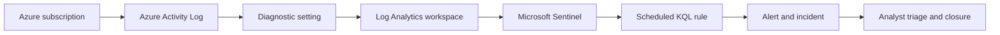
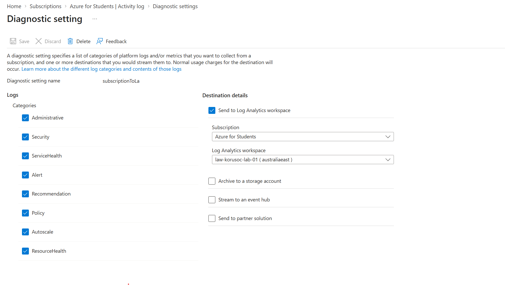
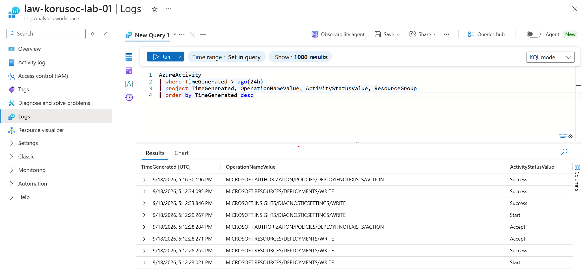
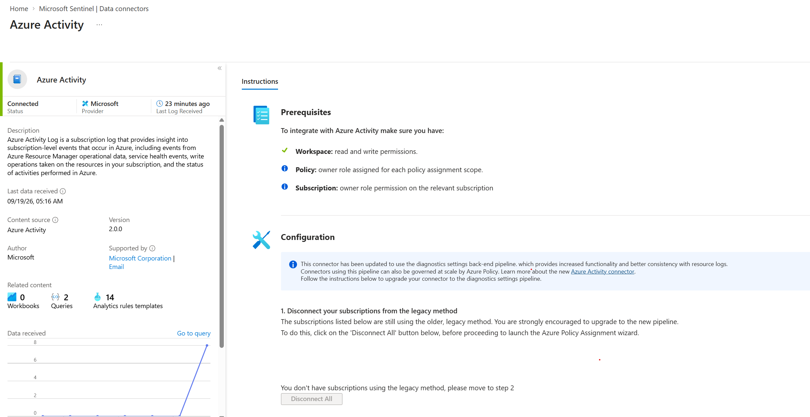
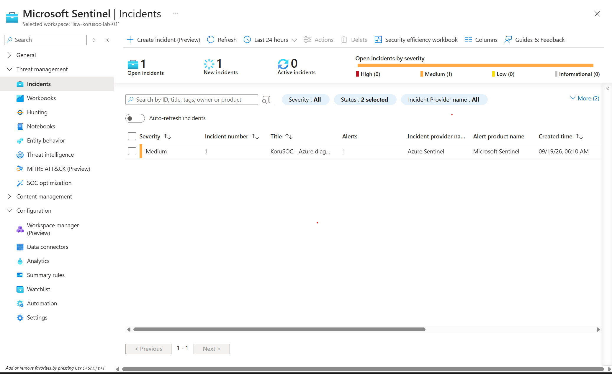
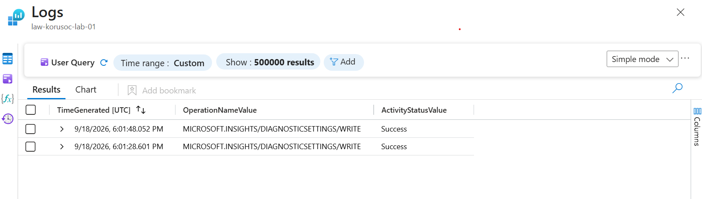
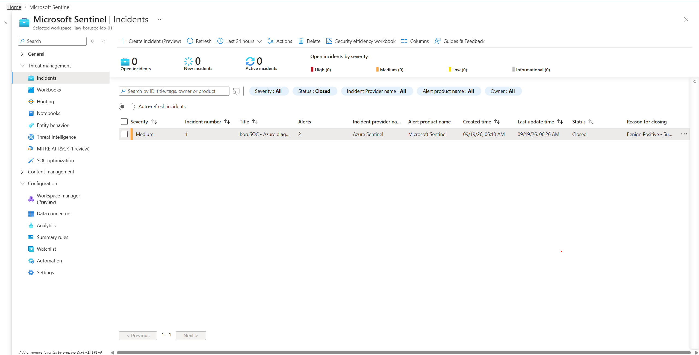

# KoruSOC — Microsoft Sentinel Detection and Response Lab

KoruSOC is my hands-on cloud security operations lab. I built it to practise the work expected in a junior SOC role: connecting telemetry, writing KQL, creating detections, investigating alerts, mapping activity to MITRE ATT&CK, and documenting an analyst decision.

The first completed use case detects changes to Azure diagnostic settings. These settings control where platform logs are sent, so an unexpected change can reduce security visibility.

## What I built

- Microsoft Sentinel on a dedicated Log Analytics workspace
- Azure Activity ingestion through a subscription diagnostic setting
- A scheduled KQL analytics rule for diagnostic-setting changes
- Account and IP entity mappings for investigation context
- Alert and incident grouping to reduce duplicate noise
- A controlled test that produced a real Sentinel incident
- An investigation and documented benign-positive closure

## Lab environment

| Component | Configuration |
|---|---|
| Azure subscription | Azure for Students |
| Resource group | `rg-korusoc-lab` |
| Log Analytics workspace | `law-korusoc-lab-01` |
| Region | Australia East |
| SIEM | Microsoft Sentinel |
| Initial data source | Azure Activity |

## Data flow



More detail is available in [architecture/README.md](architecture/README.md).

## Detection 001: Azure diagnostic settings modified

The rule detects successful create, update, or delete operations against Azure diagnostic settings.

```kusto
AzureActivity
| where OperationNameValue in~ (
    "MICROSOFT.INSIGHTS/DIAGNOSTICSETTINGS/WRITE",
    "MICROSOFT.INSIGHTS/DIAGNOSTICSETTINGS/DELETE"
)
| where ActivityStatusValue =~ "Success"
| project TimeGenerated, OperationNameValue, ActivityStatusValue,
          Caller, CallerIpAddress, ResourceGroup, ResourceId, CorrelationId
```

Rule configuration:

- Severity: Medium
- Frequency: 5 minutes
- Lookback: 10 minutes
- Threshold: more than 0 results
- Event grouping: all matching events in one alert
- Incident grouping: matching entities within one hour
- Entities: Account (`Caller`) and IP (`CallerIpAddress`)
- MITRE ATT&CK: Defense Evasion / Impair Defenses / Disable or Modify Cloud Logs (`T1562.008`)

See the complete query and tuning notes in [detections/azure-diagnostic-settings-modified.kql](detections/azure-diagnostic-settings-modified.kql).

## Test and investigation

I generated an authorised test by temporarily changing one Activity Log category and immediately restoring it. Sentinel recorded two successful diagnostic-setting writes, created alerts, and grouped them into one incident.

During triage I confirmed:

- both writes came from the expected account and source IP;
- the operations were successful and occurred seconds apart;
- the logging configuration was restored;
- there was no unexpected follow-on activity.

The incident was closed as **Benign Positive — suspicious but expected**. The full analyst write-up is in [incidents/KORU-001-diagnostic-settings-modified.md](incidents/KORU-001-diagnostic-settings-modified.md).

## Evidence

### Azure Activity sent to Log Analytics



### First KQL results



### Connector status



### Custom incident created



### Investigation evidence



### Incident closure



## Repository structure

```text
korusoc-sentinel-lab/
├── architecture/
│   └── README.md
├── detections/
│   ├── README.md
│   └── azure-diagnostic-settings-modified.kql
├── incidents/
│   └── KORU-001-diagnostic-settings-modified.md
├── screenshots/
├── .gitignore
├── LICENSE
└── README.md
```

## What I learned

- How Azure Activity events reach Sentinel through diagnostic settings and Log Analytics
- How to validate ingestion with KQL instead of relying only on a connector status page
- How scheduling, lookback windows, entity mapping, and grouping affect an analytics rule
- How to distinguish a benign positive from a false positive
- How to preserve useful evidence without publishing account, IP, or subscription information

## Next steps

- Add a privileged-role change detection
- Add an Azure resource deletion detection
- Build hunting queries around unusual administrative activity
- Create a small workbook for operations and incident trends
- Export detections as reusable Sentinel content

## Safety and privacy

All activity was performed in an authorised personal lab. Screenshots and documentation were reviewed before publication and do not include credentials, access tokens, subscription identifiers, personal email addresses, or source IP addresses.
