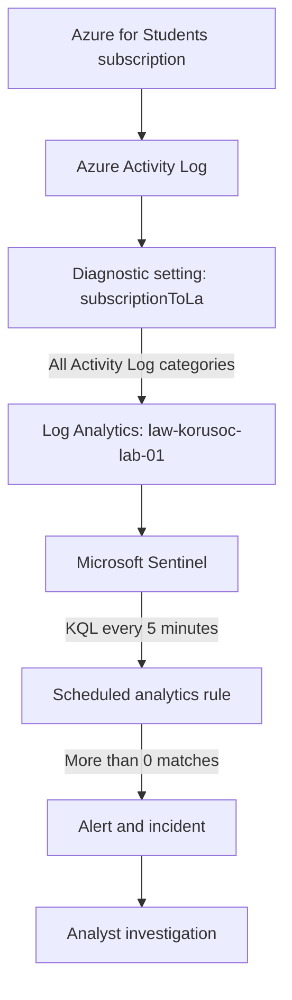

# Architecture

KoruSOC currently uses a small Azure-native pipeline so that each component is easy to understand and verify.

## Design choices

### Australia East

The Log Analytics workspace is in Australia East because it is a nearby Microsoft Sentinel-supported region for the lab.

### Azure Policy deployment

The Azure Activity connector used a subscription-scoped Azure Policy assignment with a remediation task. The policy created the diagnostic setting and directed Activity Log categories to the Sentinel workspace.

### No automated response in phase 1

The first use case intentionally stops at analyst triage. No Logic Apps playbook is attached, which keeps the workflow understandable and avoids automatically changing cloud resources while the detection is still being tuned.

## Data handled

The public repository contains only sanitised screenshots and detection logic. Account identifiers, IP addresses, subscription IDs, correlation IDs, credentials, and tokens are excluded.
